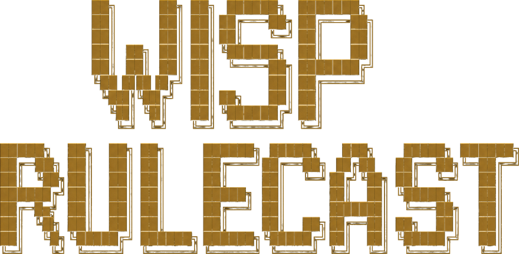

<p align="center">
  
</p>

<p align="center">
  
</p>

<p align="center">
  <a href="https://github.com/Samuel0101010/wisp-rulecast/releases"></a>
  <a href="LICENSE"></a>
  
  =20">
  
</p>

# wisp-rulecast

Compile your `CLAUDE.md` rules to real Claude Code hooks.

`CLAUDE.md` is suggestions. Claude reads "NEVER commit `.env`", agrees, then
silently writes `git add .env` on turn 47 anyway (issues
[#19635](https://github.com/anthropics/claude-code/issues/19635),
[#7777](https://github.com/anthropics/claude-code/issues/7777),
[#50235](https://github.com/anthropics/claude-code/issues/50235)).
Anthropic's own docs already point at the fix — `PreToolUse` hooks. Nobody
writes them by hand because they drift the moment the rules in `CLAUDE.md`
change. `wisp-rulecast` reads the markdown, parses the prohibitions, and
emits the hooks that actually stop the tool call before it runs.

Three minutes after you add `` NEVER commit `.env` `` to your `CLAUDE.md`,
the next `git add .env` is denied with the reason pointing back at the
source line. No retraining, no follow-up prompt, no audit trail you have
to dig through `git log` for — just a hard stop the model can't talk its
way past.

## What it looks like

<table>
<tr>
<td width="50%">

**`CLAUDE.md` — what you write**

```markdown
## Security
- NEVER commit `.env`
- NEVER commit `*.pem`
- DO NOT commit `id_rsa`

## Filesystem
- NEVER edit files in `/vendor`

## Workflow
- ALWAYS run `npm test`
  before `git commit`
- ALWAYS save tests to `/tests`

## Soft (flagged as vague)
- Prefer small functions
- Be cautious when refactoring
- NEVER commit secrets
```

</td>
<td width="50%">

**`.claude/settings.json` — what gets compiled**

```jsonc
{
  "hooks": {
    "PreToolUse": [{
      "matcher": "Bash",
      "hooks": [{
        "type": "command",
        "command": "node",
        "args": [
          "${CLAUDE_PROJECT_DIR}/.claude/wisp-rulecast/dispatch.mjs",
          "--rule", "never-commit-51678eab"
        ],
        "timeout": 5,
        "if": "Bash(git commit *|git add *|git push *)"
      }]
    }]
    // …one entry per enforceable rule
  }
}
```

</td>
</tr>
</table>

<p align="center"><em>Left: behavioral guidance. Right: mechanical enforcement. <code>compile --explain</code> tells you exactly which soft rules got dropped and how to rephrase them.</em></p>

<table>
<tr>
<td width="50%">

**`git add .env` after compile — denied**

```text
✗ Bash tool call denied by hook:

  wisp-rulecast: NEVER commit .env
  (CLAUDE.md:5)

  hookSpecificOutput.permissionDecision = "deny"
```

The model receives the reason verbatim and stops trying. No file is staged,
no retry, no half-applied change.

</td>
<td width="50%">

**`wisp-rulecast audit` — what got blocked today**

```text
# wisp-rulecast audit

Total blocked violations: 7 across 3 rule(s).

## never-commit-51678eab — 4 block(s)
> wisp-rulecast: NEVER commit .env (CLAUDE.md:5)
Recent:
- 2026-05-19T14:02Z  Bash `git add .env`
- 2026-05-19T15:11Z  Bash `git add -A`

## never-run-cmd-cc347876 — 2 block(s)
> wisp-rulecast: NEVER run rm -rf (CLAUDE.md:13)
```

</td>
</tr>
</table>

## Install — as a Claude Code plugin

```text
/plugin marketplace add Samuel0101010/wisp-rulecast
/plugin install wisp-rulecast@wisp
```

That's it. The plugin ships its own Node bundle, the skill, the slash command, and the runtime dispatcher source. No `npm install`, no global CLI, no `npm publish` 2FA dance. While the plugin is enabled the `wisp-rulecast` binary is on `PATH` and the `/wisp-rulecast` slash command is registered.

The skill auto-triggers whenever you edit `CLAUDE.md` — no manual recompile.

### Without the plugin (clone-and-run)

```bash
git clone https://github.com/Samuel0101010/wisp-rulecast.git
cd wisp-rulecast
npm install && npm run build
node dist/index.js install     # copies skill + command into your project
node dist/index.js compile
```

## Use

```bash
wisp-rulecast compile [--dry-run] [--explain]
```

— or say *"compile the rules"* / *"enforce CLAUDE.md"* in chat and the
skill triggers it for you, or type `/wisp-rulecast compile`.

### Commands

| Command | What it does |
|---|---|
| `install` | Copy skill + slash command + dispatcher into the project; first compile |
| `compile` | Parse `CLAUDE.md`, write rules.json + dispatcher + merge hooks into `settings.json` |
| `compile --dry-run` | Compute everything, write nothing |
| `compile --explain` | Print every vague rule with a refactor suggestion |
| `verify` | Spawn the dispatcher with a synthetic violating input per rule, assert it denies |
| `audit [--since 24h]` | Markdown summary of blocked violations from the JSON-lines log |
| `reset` | Remove every wisp-rulecast hook from `settings.json` (user hooks preserved) |

### Supported rule patterns

| Form | Becomes |
|---|---|
| `` NEVER commit `<pattern>` `` | `PreToolUse` on `Bash` matching git staging / commit / push |
| `` NEVER edit `<path>` `` | `PreToolUse` on `Edit\|Write\|MultiEdit` with path check |
| `` NEVER run `<command>` `` | `PreToolUse` on `Bash` with command match |
| `` ALWAYS `<X>` before `<Y>` `` | `PostToolUse` marker + `PreToolUse` deny if marker missing |
| `` ALWAYS save `<X>` to `<path>` `` | `PreToolUse` allowlist for `Edit\|Write\|MultiEdit` |

`NEVER` ≡ `DO NOT` ≡ `MUST NOT` ≡ `NO`. **Wrap your patterns in backticks** — it's the single highest-leverage thing you can do to make wisp-rulecast confident about your intent. Full grammar: [`docs/rule-grammar.md`](docs/rule-grammar.md).

## How it works

```
CLAUDE.md
   │  remark-parse → AST → paragraph candidates
   ▼
parser/                                regex classifier
   │  → EnforceableRule | VagueRule
   ▼
compiler/templates/                    one of five templates per rule
   │  → CompiledHooks
   ▼
settings-merger.ts                     idempotent: drops previous wisp-rulecast
   │                                   groups, preserves user hooks
   ▼
.claude/settings.json   .claude/wisp-rulecast/rules.json
                        .claude/wisp-rulecast/dispatch.mjs
   │
   ▼  Claude Code spawns dispatch.mjs per PreToolUse call (<50 ms target)
   │
   ▼  Exit 0 + { permissionDecision: "deny", reason: "…" }
   │
   ▼  .claude/wisp-rulecast.log   ← every block as one JSON line
```

No LLM is invoked at compile time. Pure regex classifier — predictable,
debuggable, fast. Generated hook shapes documented in
[`docs/hook-templates.md`](docs/hook-templates.md); the hooks-API reference
notes are in [`docs/notes/hooks-api.md`](docs/notes/hooks-api.md).

## Why not write the hooks by hand

You can. But `CLAUDE.md` and `settings.json` drift the second you edit one
of them. The rules and the enforcement live in two files in two languages
written for two audiences; one slips, the other doesn't notice. `wisp-rulecast`
removes the second file from your workflow — you edit the English version,
re-run `compile`, the JSON regenerates with the same rule ids and the same
behavior. Run it on save, run it in a `pre-commit` hook, run it as the
skill auto-trigger — same result.

Three structural guarantees that come for free:

- **Idempotent merge.** A hook group is "ours" iff *every* hook in it routes through
  the dispatcher. Recompiling drops only ours, leaves your hand-written hooks
  alone, and produces byte-identical output on a no-op run.
- **Self-check.** `verify` spawns the dispatcher per rule with a synthetic
  violating input and asserts deny. If your generated hooks *can't* fire,
  CI catches it before the user does.
- **Failure-safe.** Missing or malformed registry → dispatcher allows. The
  tool never blocks your work because of its own bugs.

## Related — `wisp-orchestrator`, `wisp-agentdiff`

`wisp-rulecast` is the *guardrail* layer of the agent lifecycle. Same author,
complementary tools:

| Stage | Tool |
|---|---|
| Plan + spawn + watch multi-agent runs | [**wisp-orchestrator**](https://github.com/Samuel0101010/wisp-orchestrator) |
| Stop bad tool calls before they run | **wisp-rulecast** *(this repo)* |
| Review + approve + merge per-agent worktrees | [**wisp-agentdiff**](https://github.com/Samuel0101010/wisp-agentdiff) |

## Status & roadmap

v0.1 ships the parser, five hook templates, idempotent merger, runtime
dispatcher, audit log, self-check, install command, and 53 tests including
an end-to-end dispatcher-spawn integration test. Build roadmap and open
questions live in [`CLAUDE.md`](./CLAUDE.md); v1.0 launch gate in
[`docs/launch-checklist.md`](docs/launch-checklist.md). Issues and PRs
welcome.

## Develop

```bash
npm install
npm run verify         # lint + typecheck + test + build
npm run test:watch     # iterating on a single module
npm run dev            # tsup watch build
```

CI matrix: Linux / macOS / Windows × Node 20 + 22.

## Inspired by

Karpathy's `CLAUDE.md` philosophy — but makes the rules actually enforced.

## License

MIT — see [`LICENSE`](LICENSE).
